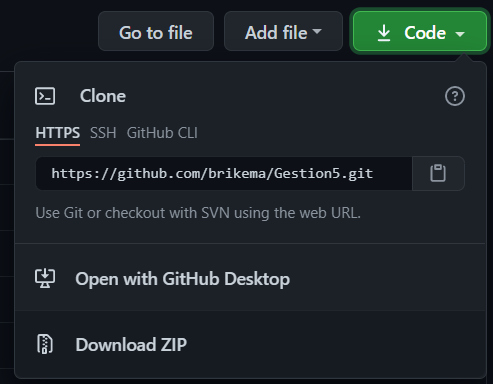
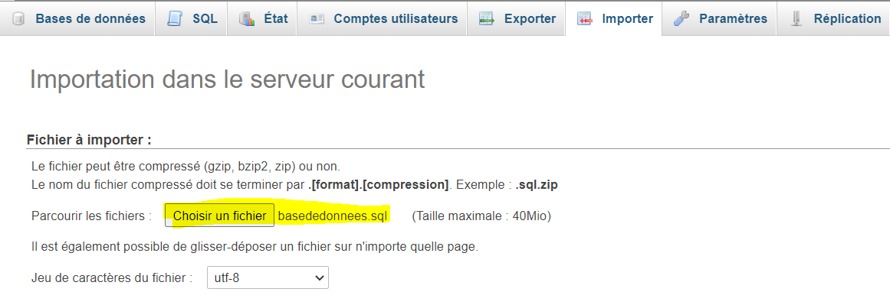
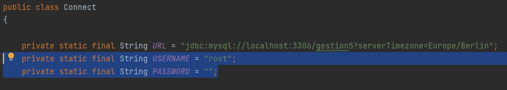

# Application Gestion5

## Installation

### Pré-requis

* Avoir java avec le jdk et jre 15 installé;
* Avoir Maven installé;
* Avoir tomcat7 installé;
* Avoir phpMyAdmin installé et en train de tourner.

### Début de l'installation

* Depuis Github, cliquer sur code, puis "Download Zip". Le fichier zip du projet va alos se télécharger.

* Il faut maintenant dezipper le projet dans le répertoire de votre choix.

### Mise en place de la base de données

* Dans phpMyAdmin, Cliquez sur "Nouvelle base de données", puis dans l'onglet "Importer", cliquer sur "choisir un fichier" et choisir le fichier "basededonnees.sql" situé à la racine du projet.

* Dans le fichier Connect.java situé dans "Gestion5-dao/src/main/java/eu/ensup/gestion5/dao/Connect.java", remplacer les valeurs de "private static final String USERNAME" et "private static final String PASSWORD" par le nom d'utilisateur et le mot de passe de votre phpMyAdmin.

### Lancement de l'application

## Fonctonalités

### Foctionalités disponibles
* Consulter la liste des étudiants
* Consulter la liste des cours
* Ajouter un étudiant
* Modifier un étudiant
* Supprimer un étudiant
* Lier un étudiant à un cours
* Donner une note à un étudiant
  
### Fonctionalités futures
* Consulter des graphiques concernant les moyennes des étudiants
* Consulter les élèves lié à un cours
* Ajouter un cours
* Modifier un cours
* Supprimer un cours

## Prochaines version (todo)

### Fonctionalités
* Gestion des dates de naissances

### Robustesse
* Gérer le cas ou quelqu'un choisit l'espace blanc dans le select
* Gérer les messages d'erreur de de réussite

### Tests